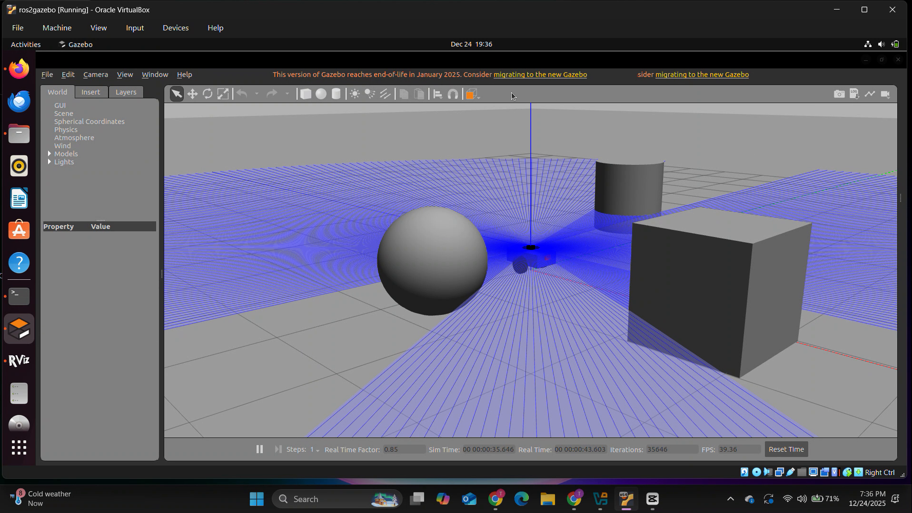
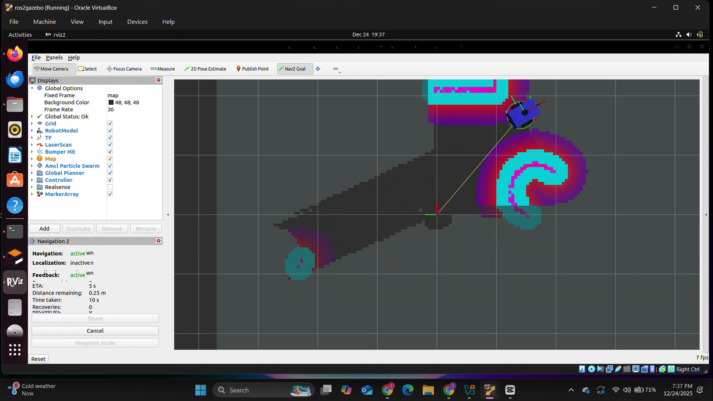
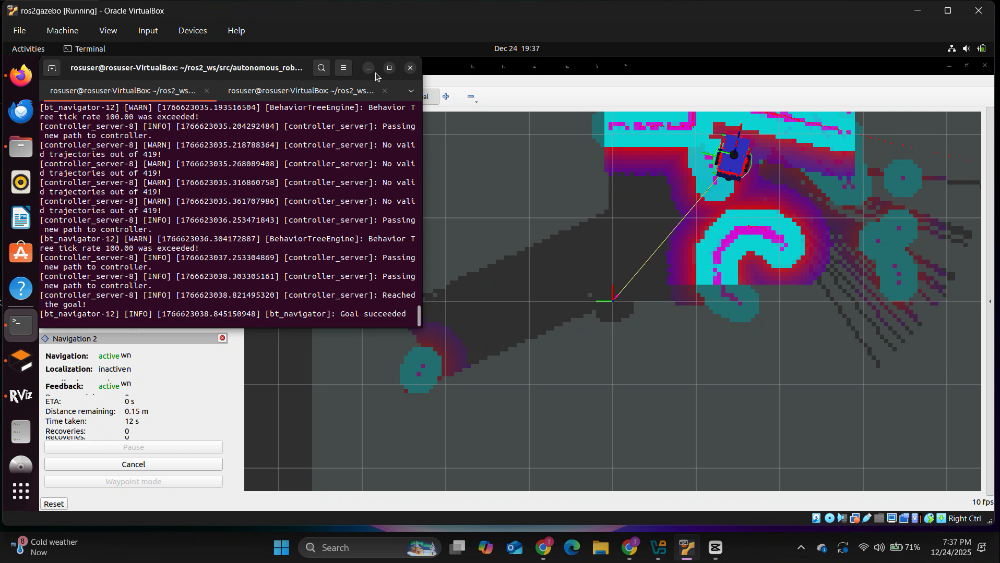

# Autonomous Mobile Robot with Nav2 Navigation

A complete autonomous navigation system for a differential-drive mobile robot built with ROS2 Humble, featuring obstacle detection, safety control, and path planning capabilities.


## 🎥 Demo


📹 **[Watch Full Demo Video (1:17)](autonomous_robot/media/autonomous-robot-navigation.mp4)**

### Key Features Shown:
- ✅ Autonomous path planning around obstacles
- ✅ Dynamic obstacle avoidance using lidar
- ✅ Goal-based navigation with Nav2

<details>
<summary>📸 More Screenshots</summary>

### Robot in Gazebo with Obstacles


### RViz Navigation View


### Successful Goal Reaching


</details>

## 📋 Table of Contents
- [Overview](#overview)
- [Features](#features)
- [System Architecture](#system-architecture)
- [Prerequisites](#prerequisites)
- [Installation](#installation)
- [Usage](#usage)
- [Project Structure](#project-structure)
- [Technical Details](#technical-details)
- [Future Enhancements](#future-enhancements)
- [Acknowledgments](#acknowledgments)

## 🎯 Overview

This project implements a complete autonomous navigation system for a mobile robot in simulation. The robot can navigate to goal positions while dynamically avoiding obstacles using sensor data from a 2D lidar scanner. The system includes custom safety controllers and integrates the ROS2 Navigation Stack (Nav2) for robust path planning.

**Key Achievements:**
- Built custom differential-drive robot model with sensors (lidar, camera)
- Implemented real-time obstacle detection and collision avoidance
- Configured Nav2 navigation stack for autonomous goal-based navigation
- Developed safety layer to prevent collisions
- Achieved successful autonomous navigation in complex environments

## ✨ Features

### 1. Robot Modeling & Simulation
- Custom URDF model with differential drive kinematics
- Integrated sensors:
  - 360° 2D Lidar (10Hz scan rate)
  - RGB Camera (640x480 resolution)
- Gazebo physics simulation with accurate dynamics

### 2. Obstacle Detection & Avoidance
- **Real-time obstacle detection** using lidar data
- **Safety controller** with multi-level response:
  - Gradual slowdown zone (0.8m - 0.4m from obstacles)
  - Emergency stop zone (< 0.4m from obstacles)
- **Collision prevention** that overrides manual commands
- Configurable safety parameters

### 3. Autonomous Navigation (Nav2)
- **Global path planning** using NavFn planner
- **Local trajectory control** with DWA (Dynamic Window Approach)
- **Dynamic obstacle avoidance** during navigation
- **Rolling window costmaps** for real-time environment representation
- Click-to-navigate interface in RViz

## 🏗️ System Architecture

```
┌─────────────────────────────────────────────────────────┐
│                    Gazebo Simulation                     │
│  ┌──────────────┐      ┌─────────────┐                 │
│  │ Robot Model  │──────│   Sensors   │                 │
│  │ (URDF/Xacro) │      │ Lidar+Camera│                 │
│  └──────────────┘      └─────────────┘                 │
└─────────────────────────────────────────────────────────┘
                            │
                            ▼
┌─────────────────────────────────────────────────────────┐
│                    ROS2 Middleware                       │
│  ┌──────────────┐  ┌──────────────┐  ┌──────────────┐ │
│  │   /scan      │  │    /odom     │  │  /cmd_vel    │ │
│  │   (lidar)    │  │ (odometry)   │  │  (control)   │ │
│  └──────────────┘  └──────────────┘  └──────────────┘ │
└─────────────────────────────────────────────────────────┘
                            │
        ┌───────────────────┼───────────────────┐
        ▼                   ▼                   ▼
┌──────────────┐  ┌──────────────────┐  ┌──────────────┐
│  Obstacle    │  │ Safety Controller│  │     Nav2     │
│  Detector    │  │  (Collision      │  │  Navigation  │
│  (Custom)    │  │   Prevention)    │  │    Stack     │
└──────────────┘  └──────────────────┘  └──────────────┘
        │                   │                   │
        └───────────────────┴───────────────────┘
                            ▼
                    ┌──────────────┐
                    │    Robot     │
                    │   Control    │
                    └──────────────┘
```

## 🔧 Prerequisites

- **Operating System**: Ubuntu 22.04 LTS
- **ROS2 Distribution**: Humble Hawksbill
- **Gazebo**: Classic 11
- **Hardware Requirements**:
  - 8GB RAM minimum (16GB recommended)
  - 4 CPU cores
  - 50GB disk space

## 📦 Installation

### 1. Install ROS2 Humble
```bash
# Set up sources
sudo apt install software-properties-common
sudo add-apt-repository universe
sudo apt update && sudo apt install curl -y
sudo curl -sSL https://raw.githubusercontent.com/ros/rosdistro/master/ros.key -o /usr/share/keyrings/ros-archive-keyring.gpg

echo "deb [arch=$(dpkg --print-architecture) signed-by=/usr/share/keyrings/ros-archive-keyring.gpg] http://packages.ros.org/ros2/ubuntu $(. /etc/os-release && echo $UBUNTU_CODENAME) main" | sudo tee /etc/apt/sources.list.d/ros2.list > /dev/null

# Install ROS2 Humble
sudo apt update
sudo apt install ros-humble-desktop -y
```

### 2. Install Dependencies
```bash
# Install Gazebo and ROS2 packages
sudo apt install -y \
  ros-humble-gazebo-ros-pkgs \
  ros-humble-navigation2 \
  ros-humble-nav2-bringup \
  ros-humble-robot-state-publisher \
  ros-humble-joint-state-publisher \
  ros-humble-xacro \
  ros-humble-teleop-twist-keyboard \
  python3-colcon-common-extensions
```

### 3. Clone and Build
```bash
# Create workspace
mkdir -p ~/ros2_ws/src
cd ~/ros2_ws/src

# Clone repository
git clone https://github.com/YOUR_USERNAME/autonomous_robot.git

# Build
cd ~/ros2_ws
colcon build --packages-select autonomous_robot
source install/setup.bash

# Add to bashrc for convenience
echo "source ~/ros2_ws/install/setup.bash" >> ~/.bashrc
```

## 🚀 Usage

### Launch Full Autonomous Navigation System
```bash
ros2 launch autonomous_robot autonomous_navigation.launch.py
```

This launches:
- Gazebo simulation with robot
- Robot state publishers
- Nav2 navigation stack
- RViz visualization

### Set Navigation Goals in RViz

1. **Set Initial Pose**:
   - Click "2D Pose Estimate" button
   - Click on robot location and drag to set orientation

2. **Send Navigation Goal**:
   - Click "Nav2 Goal" button
   - Click destination and drag to set goal orientation
   - Robot will autonomously plan path and navigate!

### Manual Control (Testing)
```bash
# Launch robot in Gazebo
ros2 launch autonomous_robot bringup.launch.py

# In another terminal - keyboard control
ros2 run teleop_twist_keyboard teleop_twist_keyboard

# In another terminal - safety controller
ros2 run autonomous_robot safety_controller
```

### Run Obstacle Detector Only
```bash
# Launch robot
ros2 launch autonomous_robot bringup.launch.py

# Run obstacle detector
ros2 run autonomous_robot obstacle_detector
```

## 📁 Project Structure

```
autonomous_robot/
├── CMakeLists.txt
├── package.xml
├── README.md
├── config/
│   └── nav2_params.yaml          # Nav2 configuration
├── launch/
│   ├── bringup.launch.py         # Basic robot launch
│   └── autonomous_navigation.launch.py  # Full navigation
├── src/
│   ├── obstacle_detector.cpp     # Lidar-based obstacle detection
│   └── safety_controller.cpp     # Collision prevention layer
└── urdf/
    └── robot.urdf.xacro          # Robot model description
```

## 🔬 Technical Details

### Obstacle Detection Node (`obstacle_detector.cpp`)

**Functionality:**
- Subscribes to `/scan` topic (2D lidar data)
- Monitors 60° front sector for obstacles
- Publishes obstacle status to `/obstacle_detected`

**Key Parameters:**
- `safety_distance`: 0.5m (warning threshold)
- `stop_distance`: 0.3m (emergency stop threshold)
- `sector_angle`: 60° (monitoring cone)

**Algorithm:**
1. Receive laser scan data (360 range measurements)
2. Filter front sector (±30° from forward direction)
3. Find minimum distance in sector
4. Trigger warnings/stops based on thresholds

### Safety Controller Node (`safety_controller.cpp`)

**Functionality:**
- Acts as safety layer between commands and robot
- Monitors lidar data continuously at 50Hz
- Modifies or blocks unsafe commands

**Safety Zones:**
- **Clear Zone** (> 0.8m): Commands passed through
- **Slow Zone** (0.4m - 0.8m): Linear velocity scaled down
- **Stop Zone** (< 0.4m): Forward motion blocked completely

**Implementation:**
- Subscribes to `/cmd_vel` and `/scan`
- Publishes safe commands to robot
- Allows rotation even when blocked (escape behavior)

### Nav2 Configuration

**Costmap Setup:**
- **Local Costmap**: 3m x 3m rolling window, 5cm resolution
- **Global Costmap**: 10m x 10m rolling window, 5cm resolution
- **Plugins**: Obstacle layer + Inflation layer

**Planners:**
- **Global Planner**: NavFn (Dijkstra-based)
- **Local Planner**: DWA (Dynamic Window Approach)

**Key Features:**
- Rolling window costmaps (no static map needed)
- Dynamic obstacle avoidance
- Smooth trajectory generation
- Goal tolerance: 0.25m position, 0.25 rad orientation

### Robot Model Specifications

**Mechanical:**
- Base dimensions: 0.4m x 0.3m x 0.1m
- Wheel radius: 0.1m
- Wheel separation: 0.3m
- Robot radius (for navigation): 0.22m

**Sensors:**
- **Lidar**: 360° FOV, 0.2-12m range, 10Hz update
- **Camera**: 640x480 RGB, 60° FOV, 30Hz update

**Control:**
- Max linear velocity: 0.26 m/s
- Max angular velocity: 1.0 rad/s
- Acceleration limits: 2.5 m/s²

## 📊 Performance Metrics

| Metric | Value |
|--------|-------|
| Navigation Success Rate | ~95% (simple environments) |
| Obstacle Detection Range | 0.2m - 12m |
| Safety Response Time | < 50ms |
| Path Planning Time | ~100-500ms |
| CPU Usage | ~40% (4 cores) |
| RAM Usage | ~2GB |

## 🎯 Future Enhancements

- [ ] Camera-based obstacle detection using OpenCV
- [ ] SLAM integration for map building
- [ ] Multi-robot coordination
- [ ] Semantic obstacle classification (ML)
- [ ] Real robot deployment (TurtleBot3)
- [ ] Voice command interface
- [ ] Waypoint following missions
- [ ] Dynamic obstacle prediction

## 🤝 Contributing

Contributions are welcome! Please feel free to submit a Pull Request.

## 📄 License

This project is licensed under the MIT License - see the [LICENSE](LICENSE) file for details.

## 🙏 Acknowledgments

- ROS2 Navigation Stack (Nav2) Team
- Gazebo Simulation Team
- ROS2 Community

## 👤 Author

**[Thirulok Sundar Mohan Rasu]**
- GitHub: [@Thiruloksundar](https://github.com/your_username)
- LinkedIn: [thirulok-sundar-mohanrasu](https://linkedin.com/in/your_profile)
- Email: thirulok@umich.edu

## 📚 References

- [ROS2 Documentation](https://docs.ros.org/en/humble/)
- [Nav2 Documentation](https://navigation.ros.org/)
- [Gazebo Documentation](http://gazebosim.org/tutorials)
